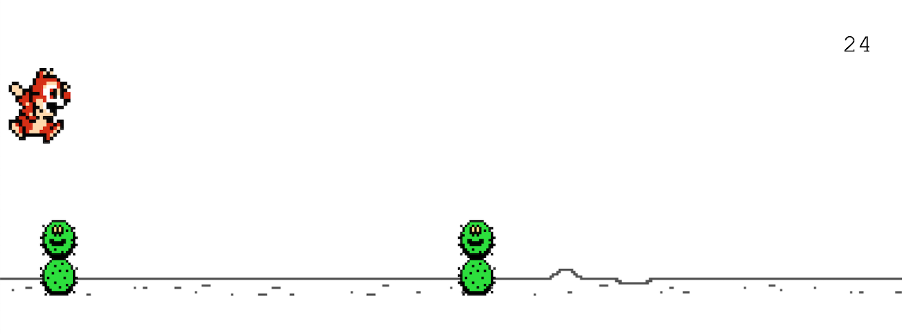

# Running Game

An endless runner game for desktop browsers built with JavaScript, HTML, and CSS. The player moves across the screen and jumps over hurdles while accumulating points. The game ends when the player collides with a hurdle.

## Features

- Endless runner gameplay with increasing difficulty.
- Jump functionality using the spacebar, up arrow, or mouse click/tap.
- Start screen with instructions and high score display.
- Persistent high score tracking using `localStorage`.
- Scales to fit different desktop screen sizes.

## Tech Stack

- **JavaScript**: Core game logic and DOM manipulation.
- **HTML**: Structure of the game elements.
- **CSS**: Styling and animations.
- **LocalStorage**: Persistent high score tracking.

## Acknowledgements

- Google Chrome Dinosaur Game.
- [How to Create Your First Game - JavaScript.](https://www.youtube.com/watch?v=47eXVRJKdkU) Web Dev Simplified. Dec. 11, 2021.
- Chip 'n Dale: Rescue Rangers (1990). Nintendo Entertainment System.
  - Player sprites for Dale from [The Spriters Resource](https://www.spriters-resource.com/nes/chipndale/sheet/441/)
- Super Mario Bros. 2 (1988). Nintendo Entertainment System.
  - Hurdle sprite for Pokey from [The Spriters Resource](https://www.spriters-resource.com/nes/supermariobros2supermariousa/sheet/123241/)
